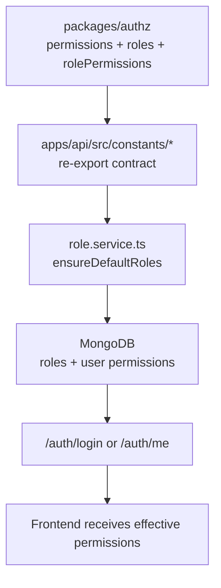

# Permission Registry Workflow

This is the new RBAC rule:

```txt
Backend/database owns who has permissions.
The shared authz package owns the permission key contract.
Frontend only checks effective permissions returned by backend.
```

## Permission Format

Every permission key must follow:

```txt
domain.resource.action.scope
```

Examples:

```txt
admin.users.read.all
admin.projects.create.all
pentest.vulnerabilities.create.assigned
security.projects.assign.self
quality.reports.submit.assigned
representative.tickets.read.own
```

Meaning:

```txt
domain   = business capability area, such as admin, security, pentest, qa
resource = protected business object, such as users, projects, reports
action   = operation, such as read, create, update, assign, approve
scope    = boundary, such as all, assigned, own, self
```

The permission key is the stable action/capability ID. More detailed runtime
conditions, such as project assignment, tenant, team, or ownership checks,
belong in backend policy code or database policy data, not in the permission
name.

The format is validated by:

```txt
packages/authz/src/permissions.ts
PERMISSION_KEY_PATTERN
```

The allowed vocabulary and metadata live in:

```txt
PERMISSION_DOMAINS
PERMISSION_ACTIONS
PERMISSION_SCOPES
PERMISSION_REGISTRY
```

## Single Contract Location

Permission names live here:

```txt
packages/authz/src/permissions.ts
```

Role names live here:

```txt
packages/authz/src/roles.ts
```

Default role grants live here:

```txt
packages/authz/src/rolePermissions.ts
```

This package is the shared contract used by both frontend and backend.

## Backend Runtime Ownership

The backend imports the shared contract through:

```txt
apps/api/src/constants/permissions.ts
apps/api/src/constants/roles.ts
apps/api/src/constants/rolePermissions.ts
```

Those files re-export from:

```txt
@role-dashboard/authz
```

The backend stores runtime RBAC state in MongoDB:

```txt
RoleModel
UserPermissionModel
UserModel.roles
```

Important backend files:

```txt
apps/api/src/modules/users/models/role.model.ts
apps/api/src/modules/users/models/userPermission.model.ts
apps/api/src/modules/users/services/role.service.ts
apps/api/src/modules/users/services/userAuth.service.ts
```

## Backend Sync Flow

The backend default role permissions come from the shared contract, then are
stored in the database.



## Frontend Flow

The frontend receives the user's effective permissions from backend auth APIs:

```txt
apps/web-fsa/src/features/auth/api/authApi.ts
```

Then it stores the user in:

```txt
apps/web-fsa/src/features/auth/model/authSlice.ts
```

The frontend checks only:

```txt
Does user.permissions contain this required permission?
```

Frontend should not decide:

```txt
Which role grants which permission?
```

That is backend/database responsibility.

## What Happens When You Add A New Permission

Add the permission key once:

```txt
packages/authz/src/permissions.ts
```

Add it to `PERMISSIONS` and `PERMISSION_REGISTRY`. Do not add duplicate aliases
for the same capability.

If it is part of a default role, add it once:

```txt
packages/authz/src/rolePermissions.ts
```

Then sync backend roles:

```bash
cd apps/api
npm run seed
```

or call the existing admin sync endpoint:

```txt
POST /api/users/roles/sync-permissions
```

If a frontend route/button needs that permission, reference the existing shared
permission constant in that one UI requirement.

## What Not To Do

Do not create new permission strings directly in:

```txt
apps/web-fsa/src
apps/api/src/modules
apps/api/src/middlewares
```

Use:

```txt
PERMISSIONS.SOME_PERMISSION
```

from the shared contract instead.

## Legacy Permission Normalization

Old stored permission strings can exist in the database from earlier versions.

The backend now normalizes known legacy strings during auth context creation:

```txt
apps/api/src/modules/users/services/userAuth.service.ts
```

Known legacy aliases live in:

```txt
packages/authz/src/permissions.ts
LEGACY_PERMISSION_ALIASES
```

If a stored user permission cannot be normalized into the shared registry, the
backend replaces that user's stored permissions with the default permissions for
the user's roles.

## Current Limitation

The frontend still owns UI route requirements, for example:

```txt
/admin/users requires admin.users.read.all
```

That is not the same as owning RBAC truth. It is only UI metadata.

Final backend-owned navigation can later expose route/sidebar policy from the
backend, but the most important part is already enforced:

```txt
Backend/database owns the user's effective permissions.
Frontend only applies them for UX.
```
