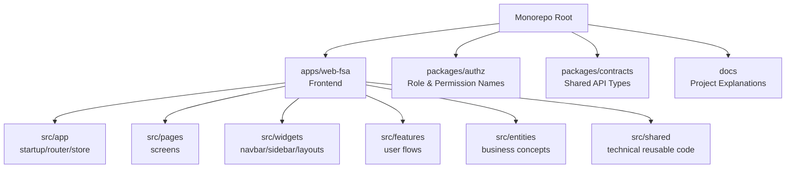
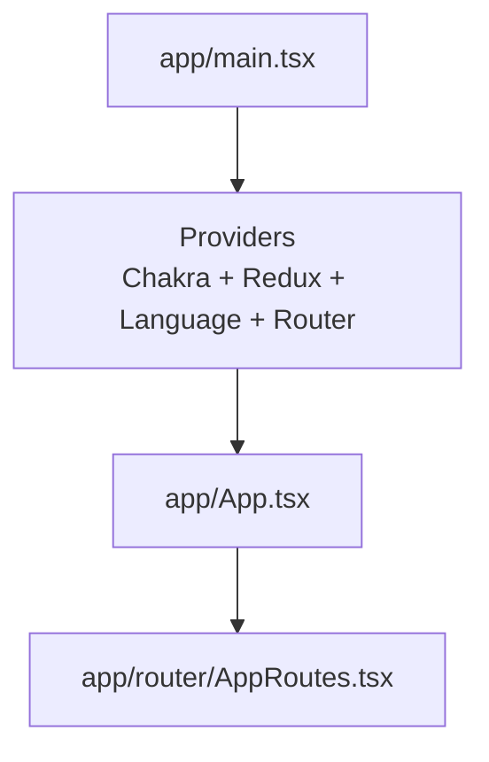
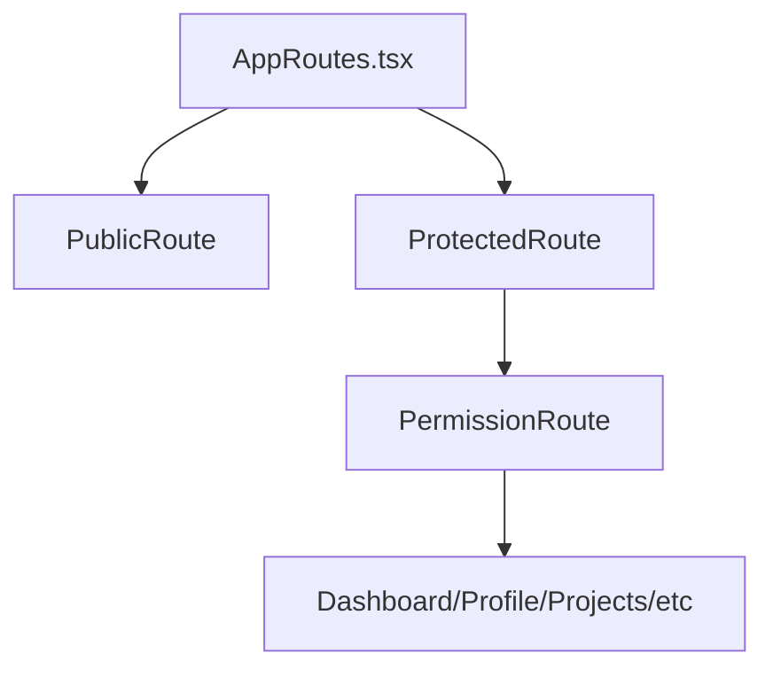
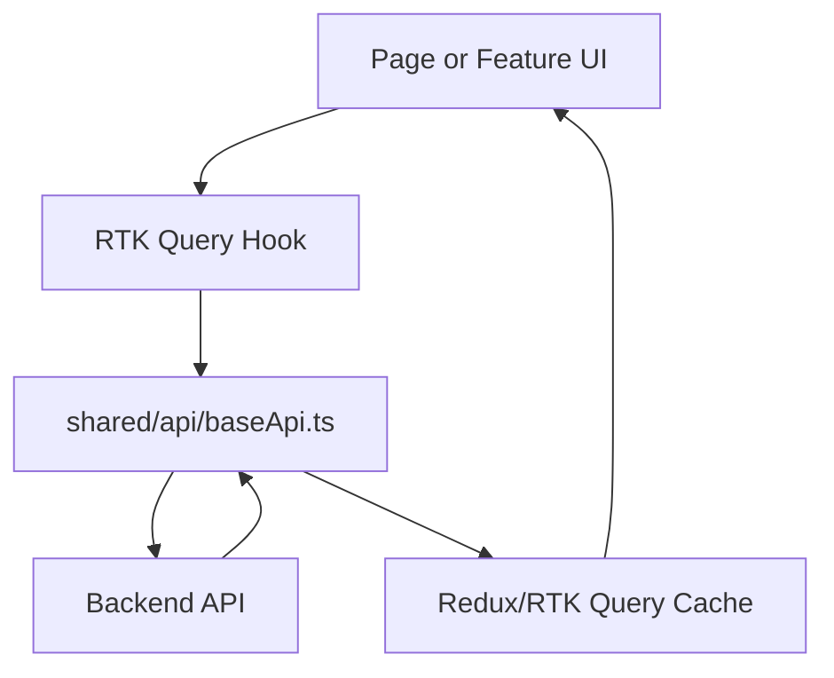
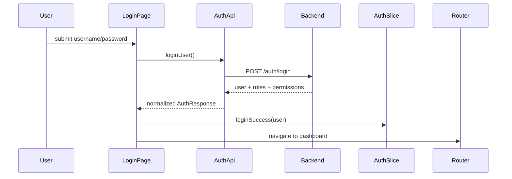
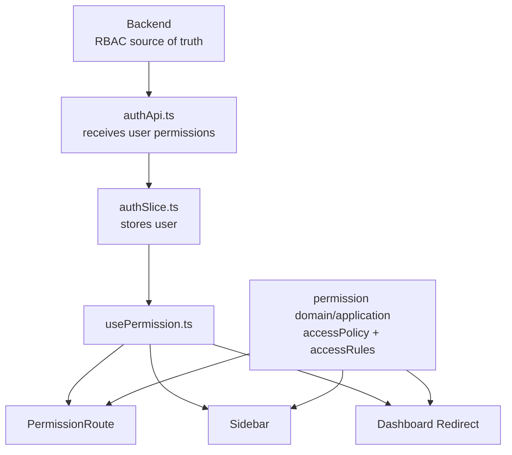
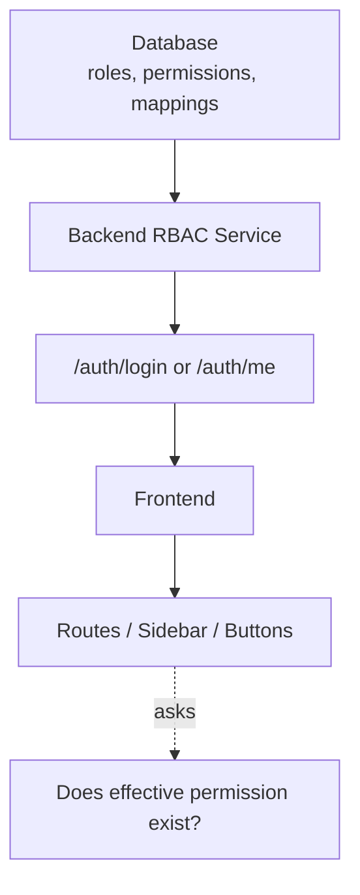

# Project Explained From Zero

This document is the calm map of the project.

If the architecture feels confusing, start here. It explains what exists now,
why it exists, what happens when the app runs, and which parts are temporary.

## 1. Current Big Picture

The project is now a monorepo.

```txt
role-dashboard-project-enterprise/
  apps/
    web-fsa/              frontend app

  packages/
    authz/                shared role/permission names
    contracts/            shared frontend/backend types

  docs/                   explanation and architecture docs
```

There is only one frontend app now:

```txt
apps/web-fsa
```

The old `apps/web` app was removed.

## 2. Current Frontend Architecture

The frontend uses Feature-Sliced Architecture.

```txt
apps/web-fsa/src/
  app/                    application startup, router, store, global styles
  pages/                  route-level screens
  widgets/                big reusable page blocks, such as sidebar/navbar/layouts
  features/               user actions and flows, such as auth/user-access
  entities/               business objects, such as permission/project/user
  shared/                 reusable technical code, UI primitives, config, API base
```

Simple meaning:

```txt
app       = how the app starts
pages     = full screens
widgets   = large UI sections used by screens
features  = actions the user can perform
entities  = business concepts
shared    = reusable tools/components/config
```

## 3. Copy This Diagram Into Mermaid Live Editor

You can paste this into:

```txt
https://mermaid.live
```



## 4. What Happens When The App Starts

Entry point:

```txt
apps/web-fsa/src/app/main.tsx
```

It wraps the app with:

```txt
ChakraProvider
Redux Provider
LanguageProvider
BrowserRouter
ErrorBoundary
Toaster
```

Then it renders:

```txt
apps/web-fsa/src/app/App.tsx
```

`App.tsx` renders:

```txt
apps/web-fsa/src/app/router/AppRoutes.tsx
```

Startup diagram:



## 5. Routing: How Pages Are Chosen

Main routing file:

```txt
apps/web-fsa/src/app/router/AppRoutes.tsx
```

Protected route config:

```txt
apps/web-fsa/src/app/router/protectedRouteConfig.ts
```

Route guards:

```txt
apps/web-fsa/src/app/router/guards/ProtectedRoute.tsx
apps/web-fsa/src/app/router/guards/PublicRoute.tsx
apps/web-fsa/src/app/router/guards/PermissionRoute.tsx
```

Meaning:

```txt
ProtectedRoute   = user must be logged in
PublicRoute      = login/signup pages should redirect logged-in users
PermissionRoute  = user must have required backend-owned permissions
```

Routing diagram:



## 6. API Layer

Base API file:

```txt
apps/web-fsa/src/shared/api/baseApi.ts
```

It is the RTK Query base API. It handles:

```txt
base URL
credentials include
CSRF token
refresh-token retry
auto logout on failed refresh
RTK Query tags
```

Feature/entity APIs inject endpoints into this base API.

Examples:

```txt
apps/web-fsa/src/features/auth/api/authApi.ts
apps/web-fsa/src/entities/user/api/usersApi.ts
apps/web-fsa/src/entities/project/api/projectsApi.ts
apps/web-fsa/src/features/notifications/api/notificationsApi.ts
```

API diagram:



## 7. Auth Flow

Login page:

```txt
apps/web-fsa/src/pages/login/Login.tsx
```

Auth API:

```txt
apps/web-fsa/src/features/auth/api/authApi.ts
```

Auth state:

```txt
apps/web-fsa/src/features/auth/model/authSlice.ts
apps/web-fsa/src/features/auth/model/useAuth.ts
```

What happens:

```txt
1. User submits login form.
2. Login page calls useLoginUserMutation.
3. authApi sends POST /auth/login.
4. Backend returns user data.
5. Frontend normalizes user.
6. authSlice stores user in Redux and localStorage.
7. App redirects user to dashboard path.
```

Auth diagram:



## 8. Very Important: Permission Source Of Truth

This is the part that caused confusion, so here is the current rule.

### Current State

Permission key names now come from the shared authz contract:

```txt
packages/authz/src/permissions.ts
```

The backend imports that contract and stores runtime role/user permissions in the
database.

The frontend has centralized UI access requirements here:

```txt
apps/web-fsa/src/entities/permission/domain/accessPolicy.ts
```

It defines things like:

```txt
which route requires which permission
which dashboard path has priority
which workspace entries are shown in sidebar
```

This file does not decide which user has which permission. It only says which
permission a route/sidebar/dashboard UI requires.

### Runtime Source Of Truth

The backend/database is the runtime source of truth for:

```txt
users
roles
permissions
role_permission mapping
user_role mapping
effective user permissions
```

The frontend receives effective permissions from the backend.

For example, backend returns:

```json
{
  "user": {
    "id": "u1",
    "name": "Admin User",
    "roles": ["admin"],
    "permissions": ["admin.users.read.all", "admin.projects.create.all"]
  }
}
```

Then frontend only checks:

```txt
Does user.permissions include "admin.users.read.all"?
```

Frontend should not decide:

```txt
admin role means admin.users.read.all
```

That is backend-owned.

See the full workflow:

```txt
docs/PERMISSION_REGISTRY_WORKFLOW.md
```

## 9. What The Current Permission Layer Does

Permission domain:

```txt
apps/web-fsa/src/entities/permission/domain/accessPolicy.ts
apps/web-fsa/src/entities/permission/domain/accessRules.ts
```

Permission application/use cases:

```txt
apps/web-fsa/src/entities/permission/application/dashboardAccess.ts
apps/web-fsa/src/entities/permission/application/routeAccess.ts
apps/web-fsa/src/entities/permission/application/sidebarAccess.ts
apps/web-fsa/src/entities/permission/application/rolePermissions.ts
```

Current purpose:

```txt
centralize frontend UI access requirements
avoid duplicating route/sidebar/dashboard permission rules
consume backend-owned effective permissions
```

Permission diagram:



## 10. Backend-Owned RBAC Rule

The project follows this rule now:

```txt
Backend owns permission truth.
Frontend owns only UI metadata and permission checks.
```

Frontend can still say:

```txt
/admin/users requires "admin.users.read.all"
```

But backend must decide:

```txt
which user has "admin.users.read.all"
which role gives "admin.users.read.all"
which API action is allowed
```

Target diagram:



## 11. Where To Change Things Today

### Change frontend route access

Start here:

```txt
apps/web-fsa/src/entities/permission/domain/accessPolicy.ts
```

Then look at:

```txt
ROUTE_ACCESS_POLICIES
```

### Change dashboard redirect priority

Start here:

```txt
apps/web-fsa/src/entities/permission/domain/accessPolicy.ts
```

Then look at:

```txt
DASHBOARD_ACCESS_PRIORITY
```

### Change sidebar main items

Start here:

```txt
apps/web-fsa/src/widgets/sidebar/model/sidebarItems.ts
```

But access decisions should still reference:

```txt
ROUTE_ACCESS_POLICIES
```

### Change sidebar workspace items

Access rule:

```txt
apps/web-fsa/src/entities/permission/domain/accessPolicy.ts
WORKSPACE_ACCESS_POLICIES
```

UI label/icon/section:

```txt
apps/web-fsa/src/widgets/sidebar/ui/Sidebar.tsx
workspaceNavigationMeta
```

### Change login behavior

```txt
apps/web-fsa/src/pages/login/Login.tsx
apps/web-fsa/src/features/auth/api/authApi.ts
apps/web-fsa/src/features/auth/model/authSlice.ts
```

### Change backend base URL / API auth behavior

```txt
apps/web-fsa/src/shared/config/backend.ts
apps/web-fsa/src/shared/api/baseApi.ts
```

## 12. What Each Layer Is Allowed To Do

```txt
app/
  startup, router, store wiring

pages/
  route screens only

widgets/
  large UI composition like sidebar/navbar/layouts

features/
  user actions and flows

entities/
  business concepts and business rules

shared/
  reusable UI, API base, config, low-level utilities
```

Recommended dependency direction:

```txt
app -> pages -> widgets -> features -> entities -> shared
```

For business rules:

```txt
UI -> application -> domain
```

## 13. What I Changed So Far

High-level changes already made:

```txt
1. Converted project to monorepo.
2. Created apps/web-fsa as the only frontend app.
3. Removed old apps/web.
4. Removed Husky and all test files.
5. Moved frontend into Feature-Sliced Architecture.
6. Added packages/authz for shared role/permission names.
7. Added packages/contracts for shared API types.
8. Added centralized frontend permission policy layer.
```

## 14. What Is Still Not Finished

Important unfinished architecture work:

```txt
1. Backend is not in this repository yet.
2. Backend-owned database RBAC is not implemented yet.
3. Frontend still has UI access policy in accessPolicy.ts.
4. Some auth/session code still uses localStorage directly.
5. Some API response normalization still lives inside API files.
```

That is okay for now, but it must be clear.

The current frontend is more organized than before, but the final enterprise
security model still requires a backend RBAC service.

## 15. Recommended Next Steps

Do these slowly:

```txt
Step 1: Freeze current frontend structure.
Step 2: Add backend app under apps/api.
Step 3: Implement backend RBAC tables and APIs.
Step 4: Make /auth/me return effective permissions from backend.
Step 5: Remove frontend role-to-permission assumptions.
Step 6: Keep frontend route requirements, but backend owns who has permissions.
```

## 16. Mental Model

Think of the frontend like this:

```txt
Backend tells frontend what the user can do.
Frontend decides what UI to show based on that.
Backend still protects the real API actions.
```

Frontend permission checks are for UX.

Backend permission checks are for security.

Both are needed.
